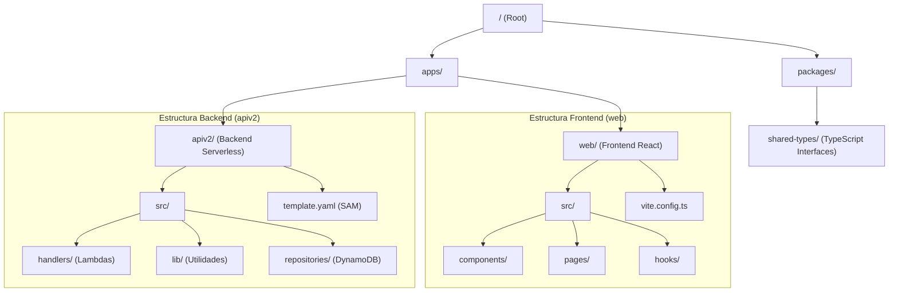

# Análisis del Proyecto: Course Builder (IA Generated Video MVP)

Este documento proporciona un análisis detallado de la estructura, arquitectura, tecnologías y funcionalidades del proyecto `ia-generated-video-mvp`.

## 1. Estructura del Proyecto

El proyecto es un monorepo gestionado con **TurboRepo** que contiene tanto el frontend como el backend.

### Diagrama de Estructura de Carpetas



### Descripción de Directorios

- **`apps/apiv2`**: Contiene todo el código del backend. Es una aplicación Serverless definida con **AWS SAM**.
- **`apps/web`**: Contiene el frontend, una Single Page Application (SPA) construida con **React** y **Vite**.
- **`packages/shared-types`**: Librería interna que exporta interfaces y tipos de TypeScript compartidos entre el backend y el frontend, asegurando consistencia en los datos.

---

## 2. Tecnologías Utilizadas

### Backend (`apps/apiv2`)

| Tecnología | Versión | Propósito |
| :--- | :--- | :--- |
| **Node.js** | 20.x | Entorno de ejecución para las funciones Lambda. |
| **AWS SAM** | - | Framework para definir la infraestructura como código (IaC). |
| **AWS SDK v3** | 3.992.0 | Comunicación con servicios de AWS (Bedrock, DynamoDB, Lambda). |
| **DynamoDB** | - | Base de datos NoSQL principal. |
| **Busboy** | 1.6.0 | Procesamiento de multipart/form-data (subida de archivos). |
| **Mammoth** | 1.8.0 | Extracción de texto desde archivos `.docx`. |
| **PDF.js** | 3.11.174 | Extracción de texto desde archivos `.pdf`. |
| **Esbuild** | 0.24.2 | Empaquetado y minificación del código Lambda. |

### Frontend (`apps/web`)

| Tecnología | Versión | Propósito |
| :--- | :--- | :--- |
| **React** | 19.x | Librería principal de UI. |
| **Vite** | 7.x | Build tool y servidor de desarrollo rápido. |
| **TailwindCSS** | 3.4 | Framework de utilidades CSS para estilos. |
| **React Query** | v5 | Gestión de estado asíncrono y cacheo de datos. |
| **i18next** | 25.x | Internacionalización (Soporte Inglés/Español). |
| **React Router** | 6.x | Enrutamiento del lado del cliente. |
| **React Hook Form** | 7.x | Gestión de formularios. |

---

## 3. Funciones y Funcionalidades (Backend)

El backend está dividido en 4 funciones Lambda principales, orquestadas por API Gateway.

### A. `AiScriptsFunction`
- **Tipo:** Síncrona (Request/Response).
- **Rutas:** `/ai-scripts` (CRUD).
- **Funcionalidad:**
    - Gestiona la creación, lectura, actualización y borrado de scripts.
    - Maneja la subida de archivos (PDF/DOCX) y extracción de texto.
    - **Trigger:** Al crear un script, guarda el estado inicial `PENDING` en DynamoDB e invoca asíncronamente a `AiScriptsWorkerFunction`.

### B. `AiScriptsWorkerFunction`
- **Tipo:** Asíncrona (Event-driven).
- **Funcionalidad:**
    - Recibe eventos de generación de scripts.
    - Interactúa con **AWS Bedrock (Claude 3.5 Sonnet)** para generar contenido educativo.
    - Actualiza el estado del script en DynamoDB a `PROCESSING` y finalmente a `COMPLETED`.
    - Maneja errores actualizando el estado a `ERROR`.

### C. `VideosFunction`
- **Tipo:** Síncrona.
- **Rutas:** `/videos/*`.
- **Funcionalidad:**
    - `POST /videos/generate/{scriptId}`: Solicita la creación de un video a la API de **Synthesia**.
    - `GET /videos/status/{videoId}`: Consulta el estado del renderizado del video.
    - `GET /videos/{videoId}/download-url`: Obtiene la URL de descarga del video final.
    - `DELETE /videos/{videoId}`: Elimina videos.

### D. `TemplatesFunction`
- **Tipo:** Síncrona / Proxy de Cache.
- **Rutas:** `/videos/templates/*`.
- **Funcionalidad:**
    - Actúa como intermediario con la API de Synthesia para listar templates disponibles.
    - Permite obtener detalles de un template específico para mostrarlos en el frontend.

---

## 4. Arquitectura y Conexiones API

### Diagrama de Arquitectura

```mermaid
graph TD
    Client[Cliente Web (React)]
    APIGWQ[API Gateway]
    
    subgraph AWS Cloud
        Lambda1[AiScriptsFunction]
        Lambda2[AiScriptsWorkerFunction]
        Lambda3[VideosFunction]
        Lambda4[TemplatesFunction]
        
        DB[(DynamoDB)]
        Bedrock[AWS Bedrock (Claude 3.5)]
    end
    
    subgraph External Services
        Synthesia[Synthesia API]
    end
    
    Client -->|HTTPS| APIGWQ
    APIGWQ -->|/ai-scripts| Lambda1
    APIGWQ -->|/videos| Lambda3
    APIGWQ -->|/templates| Lambda4
    
    Lambda1 -->|CRUD| DB
    Lambda1 -.->|Invoke Async| Lambda2
    
    Lambda2 -->|Get Context| DB
    Lambda2 -->|Generate Content| Bedrock
    Lambda2 -->|Update Context| DB
    
    Lambda3 -->|Create Video| Synthesia
    Lambda3 -->|Update Status| DB
    
    Lambda4 -->|List Templates| Synthesia
```

### Conexiones con APIs Externas

1.  **AWS Bedrock (Interna/AWS):**
    - **Modelo:** `us.anthropic.claude-3-5-sonnet-20241022-v2:0`.
    - **Uso:** Generación de guiones educativos, análisis de documentos, regeneración de escenas específicas.

2.  **Synthesia API (Externa):**
    - **Auth:** `SYNTHESIA_API_KEY`.
    - **Uso:**
        - Obtención de lista de templates.
        - Generación de videos (Text-to-Video).
        - Webhooks/Polling para estado de generación (en este MVP parece usarse polling desde el cliente o consulta bajo demanda).

3.  **DynamoDB (Persistencia):**
    - **Modelo de Datos:** Single Table Design.
    - **Entidades:** `SCRIPT`, `VIDEO`.
    - **Índices:** GSI1 para consultas por tipo y fecha.

---

## 5. Notas Adicionales

- **Despliegue:** Se realiza mediante **SAM CLI**, subiendo artefactos a S3 y desplegando un stack de CloudFormation.
- **Local Development:** Soporte completo para emulación local usando `sam local start-api` y DynamoDB en Docker.
- **Compartición de Código:** El paquete `shared-types` es crítico para mantener la sincronización de contratos de datos entre el frontend y el backend.
